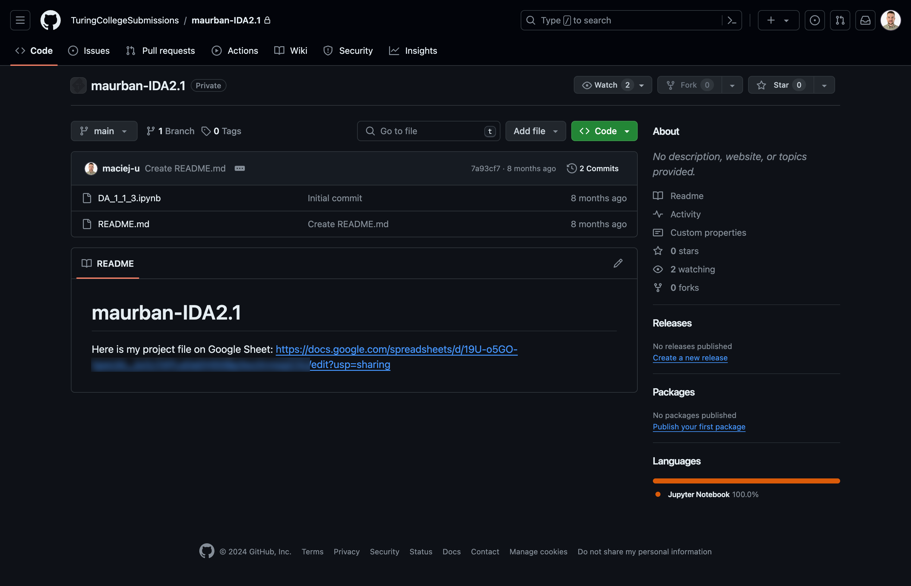
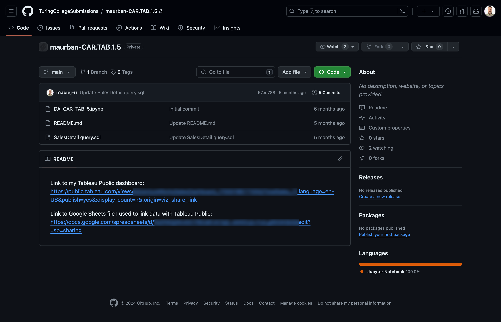
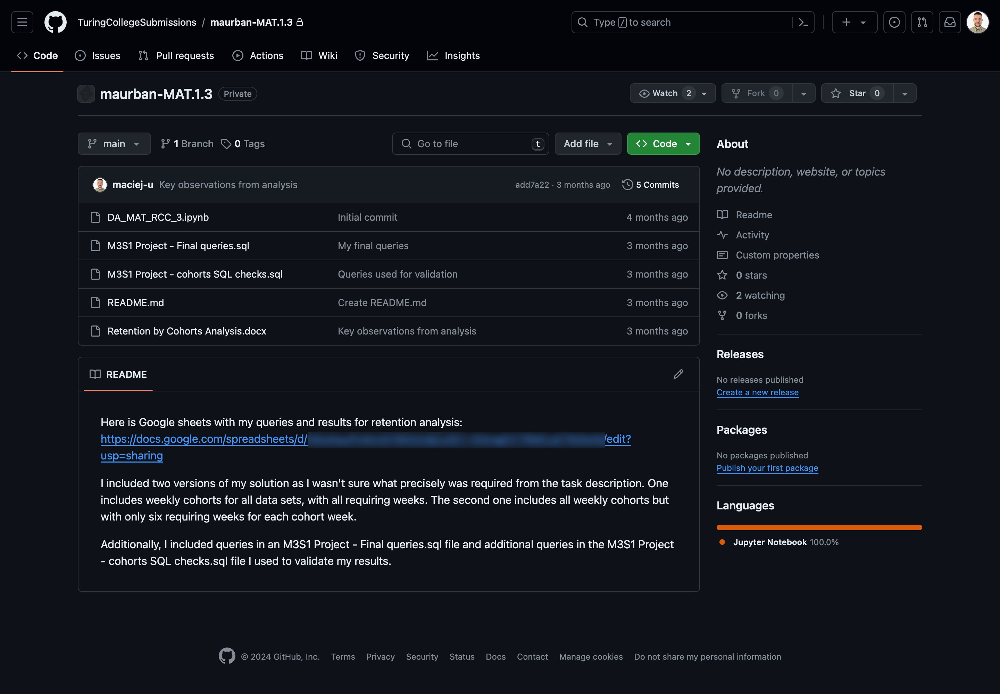
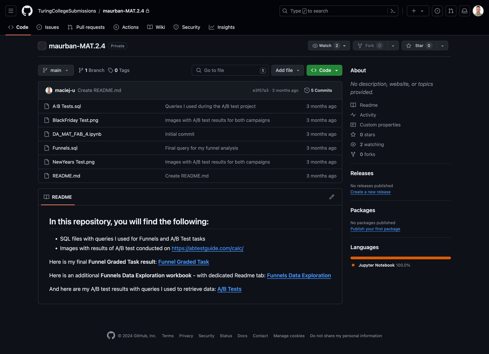
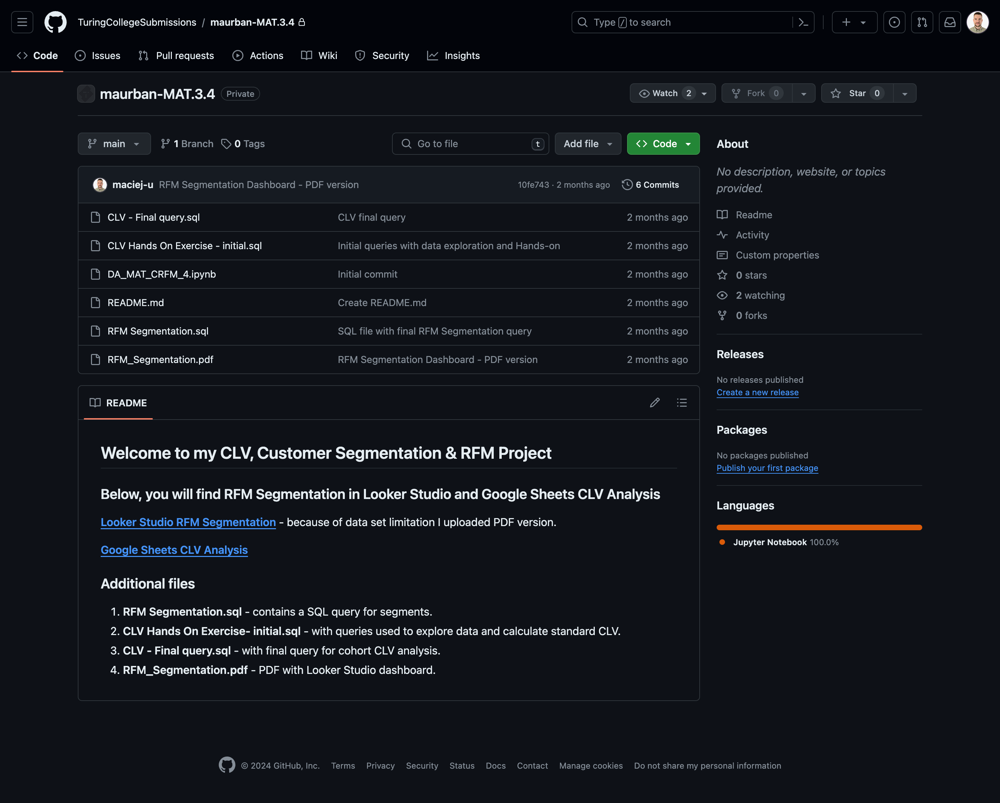
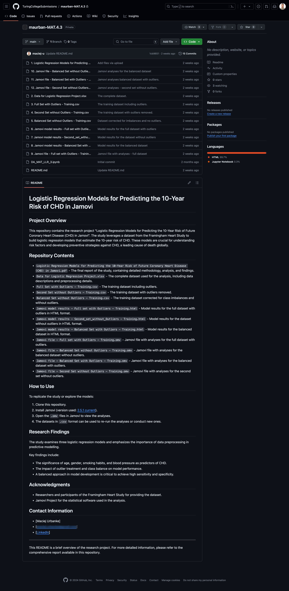

# README Evolution

## Repository Overview
This repository showcases the evolution of README files and the accompanying project documentation submitted to GitHub throughout my Data Analytics course at Turing College. Each file represents the README at the time of submission for a specific module and sprint. The files illustrate the improvements made in documentation design, organization, and readability throughout the program.

## Reflection

Starting out, my first **README** was pretty basic — just a link and nothing else. I didn't know much about GitHub or how to make things look good on it. But with each project, I tried to do a little better, adding bits here and there, making it easier for anyone who came across my work to understand what I was up to.

Now, when I look back, I see a bunch of small steps that have added up. I've gotten better at explaining my work clearly and learned that the little details make a difference. It feels good to know that I'm leaving behind something that's not just for grades but also useful for others, maybe even for future me.

Ultimately, I've learned a lot — not just about data but also about sharing it. And that's something worth noting.

## Incremental Improvements in Documentation

Each snapshot below captures a stage in the progression of my skills in creating clear, informative, and engaging documentation for analytical projects.

**My first GitHub submission** was straightforward — a simple README with a direct link to the project's Google Sheet. It was the initial step in documenting and sharing my work, highlighting the importance of starting somewhere and improving from there.
- `01_First_README_M1S1_DA.png` - _The initial submission for Module 1 Sprint 1 - Structured Approach to Data Analytics._ 

**By the third repository**, SQL files appeared, marking a more structured approach and use of GitHub's capabilities.
- `02_Third_README_M1S3_DA.png` - _The third submission, the first time I included additional files in the repository for Module 1 Sprint 3 - SQL and Databases._ 

**The fifth repository** included the introduction of Tableau dashboards. It was a step toward not just analysing data but also presenting it in a way that others could easily interpret and explore.
- `03_Fifth_README_M2S1_DA.png` - _An incremental improvement with the fifth project for Module 2 Sprint 1 - Visualising Data Using Tableau._ 

**In the seventh repository**, the documentation had matured. I included comprehensive SQL queries and validation checks, ensuring methodological clarity and a clear overview for reviewers.
- `04_Seventh_README_M3S1_DA.png` - _The seventh project submission for Module 3 Sprint 1 - Retention Cohorts & Churn, which included more detailed documentation._ 

**The eighth repository** was a leap in structure and user-centric design. It contained a well-organised listing of contents, including detailed methodologies and results, enhancing the usefulness of the repository.
- `05_Eighth_README_M3S2_DA.png` - _A significant enhancement in the documentation for Funnels & A/B Tests during Module 3 Sprint 2, featuring structured headings and embedded links._ 

**By the ninth repository**, I offered a clear and welcoming introduction to the projects, along with methodically described SQL files and analysis workbooks, which provided an in-depth understanding of the work involved.
- `06_Ninth_README_M3S3_DA.png` - _Further refinement for Module 3 Sprint 3 - CLV Customer Segmentation & RFM, focusing on accessibility and clarity._ 

**The tenth repository** represented a polished and professional level of documentation, with a comprehensive overview and structured guidance for using the repository, along with key research findings and contact information, setting a new standard for my future projects.
- `07_Tenth_README_M3S4_DA.png` - _The latest and most polished version for Linear and Logistic Regression in Module 3 Sprint 4, with comprehensive descriptions and organised files._ 

## Sources Used for Incremental Improvement
To enhance my README files and the overall presentation of my repositories, I turned to various helpful resources. Each one contributed to my learning in a unique way:
- [Basic writing and formatting syntax](https://docs.github.com/en/get-started/writing-on-github/getting-started-with-writing-and-formatting-on-github/basic-writing-and-formatting-syntax): This was my go-to guide for mastering Markdown. It helped me understand how to format text, include images, and create a visually appealing README.
- [Managing your profile README]( https://docs.github.com/en/account-and-profile/setting-up-and-managing-your-github-profile/customizing-your-profile/managing-your-profile-readme): This resource taught me how to make a great first impression with my GitHub profile by showcasing a well-crafted README.
- [How to write a good Readme for your Data Science project on GitHub]( https://medium.datadriveninvestor.com/how-to-write-a-good-readme-for-your-data-science-project-on-github-ebb023d4a50e): From this article, I learned about the importance of a README in contextualising data science projects and how to outline my work process clearly.
- [How to create an Impressive GitHub Profile README | Optimize your GitHub]( https://youtu.be/7K8JctEM-Uk?si=cjcr5GyvNCSXr8k7): This video gave me creative ideas and tips on optimising my GitHub README to stand out and effectively communicate my projects.
  
## Feedback and Contributions

I warmly welcome your input to refine the project documentation further. Your perspectives are crucial for fostering a collaborative environment and continuous enhancement. If you have any suggestions or thoughts or would like to propose improvements, please feel free to:
- [Report an Issue](https://github.com/maciej-u/README-Evolution/issues): If you spot anything that could be improved or have an idea for a new feature, let me know by opening an issue.
- [Contribute with a Pull Request](https://github.com/maciej-u/README-Evolution/pulls): Contributions to the project are highly appreciated. Submit a pull request if you've made an enhancement or fixed an issue and would like to integrate it into the project.

Your engagement is not just helpful — It's at the heart of open-source collaboration and drives the quality of this project ever higher.
  
## Contact Information
If you have questions or are interested in discussing data analytics and project documentation, I'm always open to sharing insights and exploring new ideas. Feel free to connect with me on [LinkedIn](https://www.linkedin.com/in/maciej-urbanke/) or read [About Me](https://github.com/maciej-u) on my GitHub profile.

Whether it's feedback on the projects, inquiries about collaborations, or just a chat about the data world, I'm just a message away.
